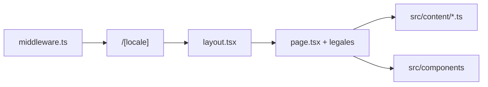

# Estructura del proyecto (latroupe-marketing)

Sitio con **Next.js 15** (App Router), **React 19** y **TypeScript**. Rutas localizadas bajo `/[locale]` (`es` / `en`), con **middleware** para redirección y preferencia de idioma. Despliegue recomendado: **Vercel** ([VERCEL.md](./VERCEL.md)).

## Árbol lógico

```
latroupe-marketing/
├── docs/
│   └── PROJECT_STRUCTURE.md    # Este documento
├── lambda/                     # Backends AWS Lambda, independientes del hosting
│   ├── contact/                # Formulario de contacto + leads del chat (SES)
│   └── chat/                   # Chat "Latty" (Anthropic SDK + prompt.mjs)
├── public/                     # Estáticos servidos tal cual
│   ├── fonts/                  # Tipografías (Roobert)
│   └── images/                 # Logos, proyectos, assets de marca
├── src/
│   ├── app/
│   │   ├── globals.css         # Tokens CSS y estilos base
│   │   ├── layout.tsx          # Shell HTML (fuentes, meta)
│   │   └── [locale]/           # Rutas por idioma
│   │       ├── layout.tsx      # Header, footer, contexto locale
│   │       ├── page.tsx        # Home
│   │       ├── aviso-legal/    # Legal ES
│   │       ├── cookies/
│   │       ├── legal-notice/   # Legal EN
│   │       ├── privacidad/
│   │       └── privacy/
│   ├── components/             # UI por bloques (Hero, Projects, Legal…)
│   │   └── Chat/                # ChatLauncher + ChatWidget + LeadMiniForm
│   ├── content/                # Copys y textos legales (es/en + tipos)
│   ├── lib/                    # i18n, hooks, tokens de diseño, contexto locale
│   │   └── chat/                 # Copy del chat (es/en) y tracking GA4
│   └── middleware.ts           # Locale y redirecciones
├── next.config.js
├── package.json
└── tsconfig.json
```

## Convenciones

| Carpeta | Uso |
|--------|-----|
| `src/app/[locale]` | Solo páginas y layouts; mínima lógica de negocio. |
| `src/components` | Componentes reutilizables; CSS Modules junto al `.tsx` cuando aplica. |
| `src/content` | Fuente de verdad de textos y tipos compartidos (`types.ts`). |
| `src/lib` | Utilidades sin UI (i18n, hooks, design tokens). |
| `public` | Imágenes y fuentes referenciadas por URL (`/images/...`). |

## Flujo de datos (i18n)



## Evolución recomendada

- **CMS**: añadir capa `src/lib/cms` y tipos en `src/content` sin romper rutas.
- **API**: rutas `src/app/api` solo si hace falta servidor (formularios, webhooks).
- **Tests**: `__tests__` junto a módulos o carpeta `src/__tests__` según se unifique el criterio del equipo.

## Despliegue

- **Producción (recomendado):** [Vercel](./VERCEL.md) — Node + middleware + Image Optimization.
- **Opcional:** export estático en subcarpeta vía FTP; ver [DEPLOY_HOSTINGER.md](./DEPLOY_HOSTINGER.md) (flujo antiguo `/beta`).
- **`withBasePath()`** en `src/lib/paths.ts` solo aplica si defines `NEXT_PUBLIC_BASE_PATH` (por defecto vacío).
